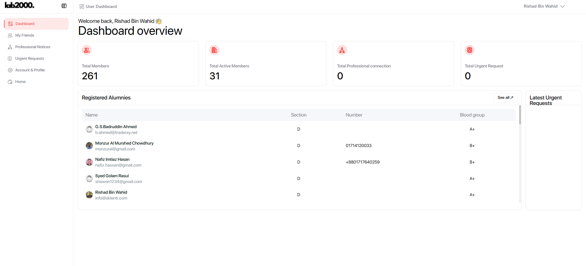
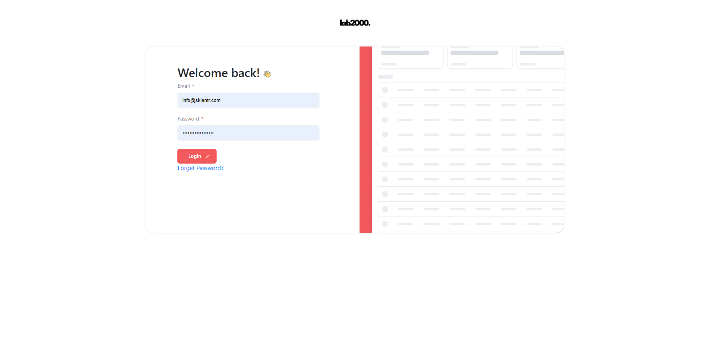
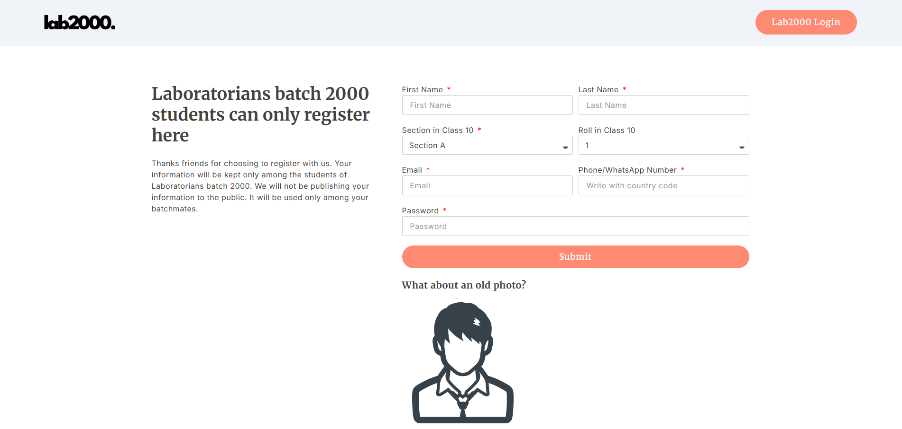
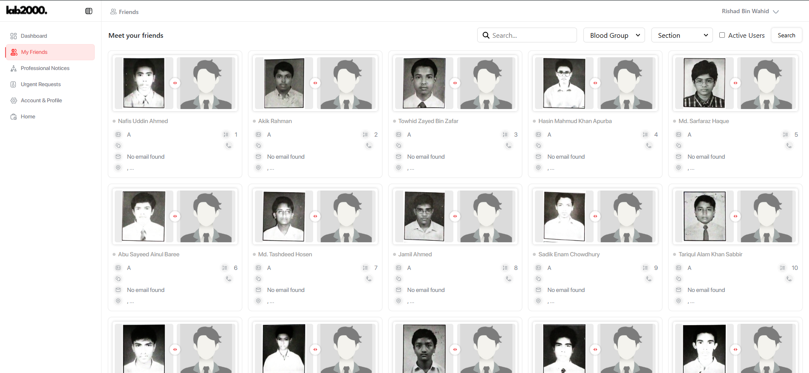
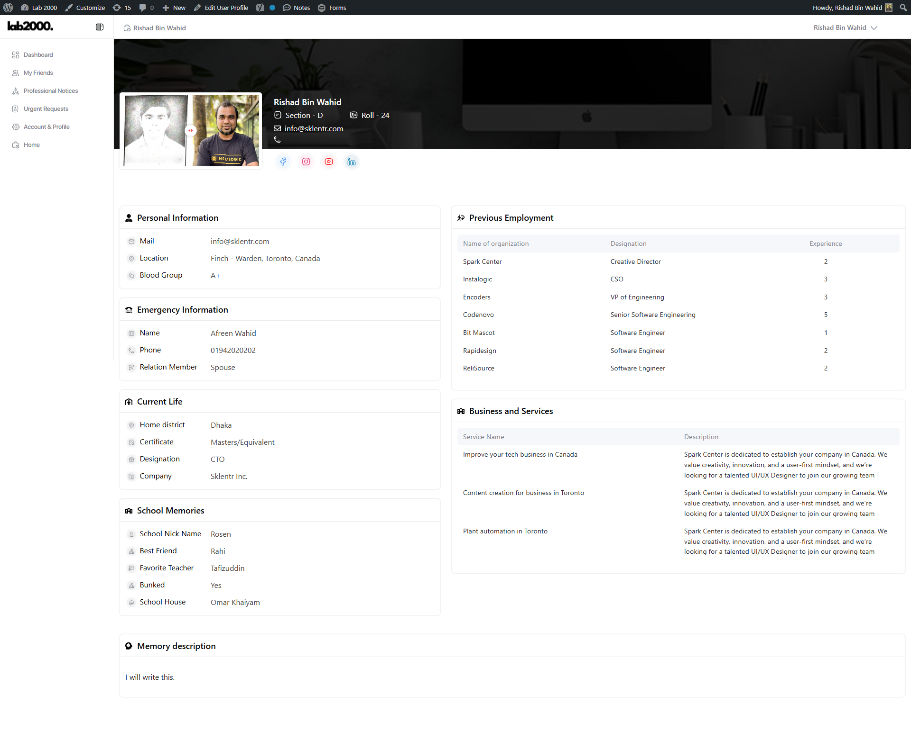
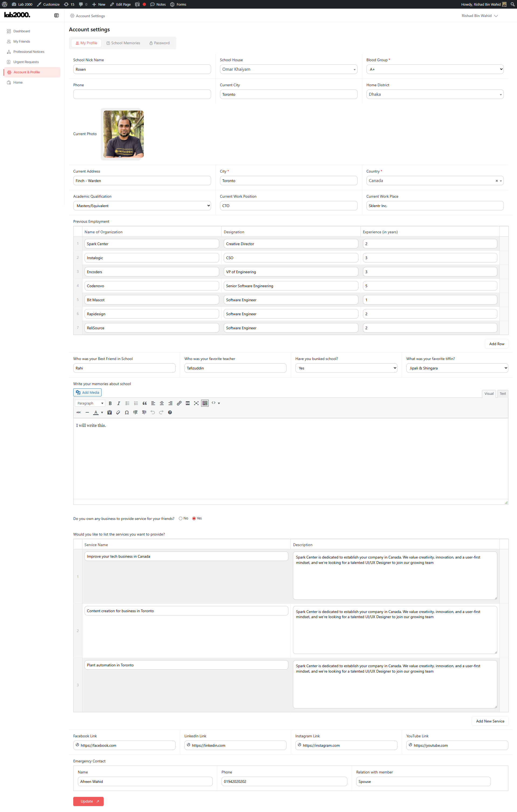
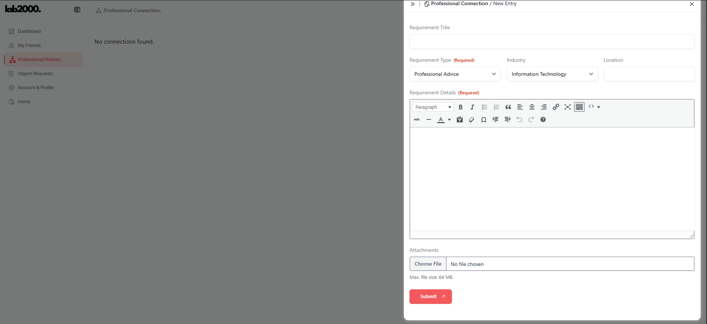
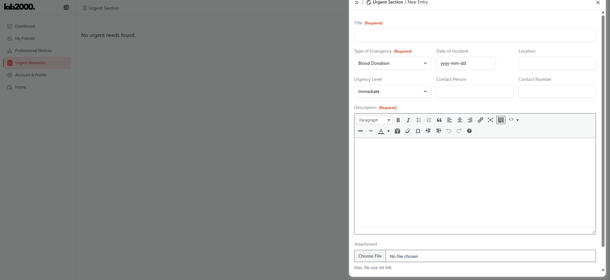
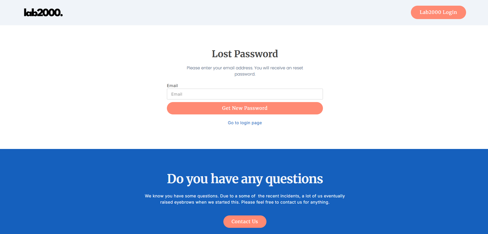
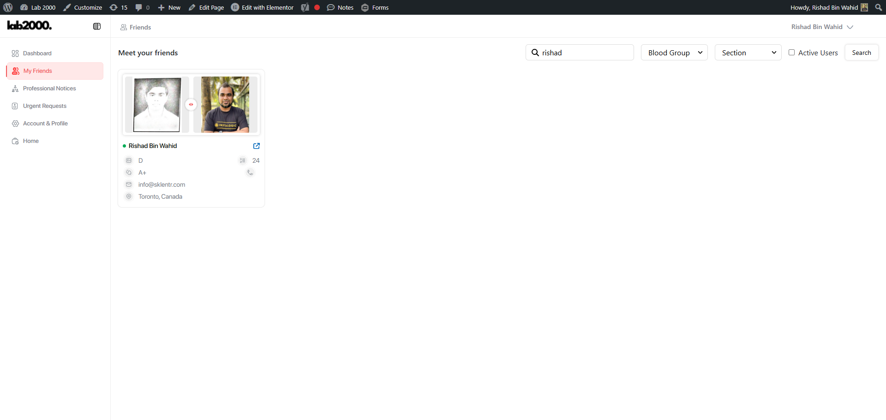

# Laboratorians 2000

An exclusive alumni directory, communication platform, and professional networking system built for the SSC Batch 2000 graduates of **Government Laboratory High School (GLHS), Dhaka**.



## About

Laboratorians 2000 is a closed-community platform connecting 261 GLHS SSC Batch 2000 alumni. The system features identity-verified registration using pre-seeded school records, a searchable alumni directory, professional networking, urgent community requests, and real-time notifications.

## Tech Stack

| Layer | Technology |
|---|---|
| **Backend** | Laravel 12 (PHP 8.2+) |
| **Frontend** | Next.js 16 (React 19) |
| **Styling** | Tailwind CSS 4 + SCSS + ShadCN UI |
| **Database** | MySQL |
| **Authentication** | Laravel Sanctum (token-based SPA auth) |
| **Email** | Laravel Mail (SMTP / Mailgun / SES) |
| **Theme** | `next-themes` (Dark / Light / System) |

## Features

- **Identity-Verified Registration** — Photo confirmation against pre-seeded school records
- **Alumni Directory** — Searchable, filterable member grid with profile photos
- **Professional Notices** — Post business services, career opportunities, and professional requirements
- **Urgent Requests** — Emergency community support (blood donations, assistance)
- **Real-Time Notifications** — In-app and email alerts for key events
- **Dark / Light Mode** — Seamless theme switching with system preference detection
- **100% Responsive** — Mobile, tablet, desktop, and large screen support

## Screenshots

<details>
<summary>View Screenshots</summary>

| Screen | Preview |
|---|---|
| Login |  |
| Registration |  |
| Dashboard |  |
| Members |  |
| Profile |  |
| Account Settings |  |
| Professional Notices |  |
| Urgent Requests |  |
| Forgot Password |  |
| Search Results |  |

</details>

## Prerequisites

- **PHP** >= 8.2
- **Composer**
- **Node.js** >= 18
- **MySQL**
- **WampServer** (recommended for Windows) or any LAMP/LEMP stack

## Getting Started

### 1. Clone the Repository

```bash
git clone https://github.com/your-username/laboratorians2000.git
cd laboratorians2000
```

### 2. Backend Setup (Laravel)

```bash
cd backend

# Install PHP dependencies
composer install

# Create environment file
cp .env.example .env

# Generate application key
php artisan key:generate

# Configure your database in .env, then run migrations
php artisan migrate

# Seed the database with alumni records
php artisan db:seed

# Start the backend server
php artisan serve --port=8000
```

### 3. Frontend Setup (Next.js)

```bash
cd frontend

# Install dependencies
npm install

# Create environment file
cp .env.example .env.local

# Start the development server
npm run dev
```

### 4. Access the Application

- **Frontend:** http://localhost:3000
- **Backend API:** http://localhost:8000

## Project Structure

```
laboratorians2000/
├── backend/                # Laravel API
│   ├── app/                # Models, Controllers, Services
│   ├── config/             # Application configuration
│   ├── database/           # Migrations, seeders, factories
│   ├── routes/             # API routes
│   ├── storage/            # File uploads, logs
│   └── ...
├── frontend/               # Next.js SPA
│   ├── src/                # Source code
│   │   ├── app/            # Pages and routing
│   │   └── components/     # Reusable UI components
│   ├── public/             # Static assets
│   └── ...
├── lab200/                 # Design reference screenshots
└── PROJECT_DOCUMENTATION_AND_TASK_PLAN.md
```

## Routes

| Route | Description | Auth |
|---|---|---|
| `/login` | Email + Password login | No |
| `/registration` | Identity-verified registration | No |
| `/lost-password` | Password reset request | No |
| `/user-dashboard` | Dashboard with stats and overview | Yes |
| `/members` | Alumni directory with search/filter | Yes |
| `/professional-notices` | Professional networking posts | Yes |
| `/urgent-requests` | Emergency community requests | Yes |
| `/account-settings` | Profile and account management | Yes |

## Database

The system uses a pre-loaded database of 261 alumni records (name, section, roll number, school photo) across 4 class sections (A-D). Core tables:

- `alumni_records` — Pre-seeded student data
- `users` — Registered accounts linked to alumni records
- `notifications` — In-app notification log
- `urgent_requests` — Emergency community requests
- `professional_notices` — Business/professional posts
- `user_preferences` — Theme and user settings

## License

This project is private and intended for the GLHS Batch 2000 alumni community only.
